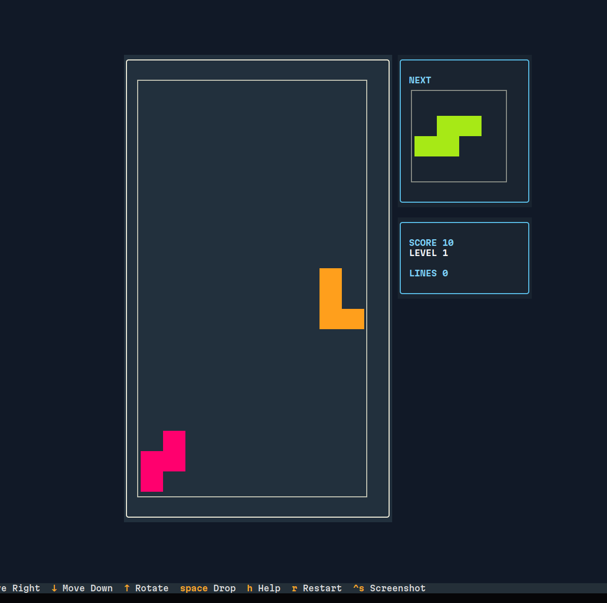
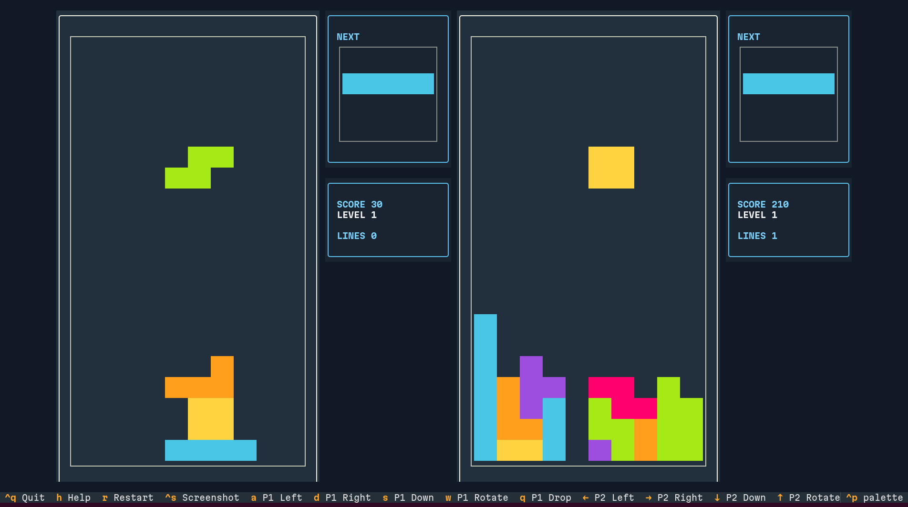

# textual-tetris

textual-tetris is a minimalist Tetris clone written with [Textual](https://textual.textualize.io/), an amazing TUI framework for Python. It focuses on compact components, colorized blocks, and a responsive keyboard feel in the terminal.

## Running
The easiest way is using `uvx` (part of [uv](https://docs.astral.sh/uv/)): 

```bash
uvx textual-tetris
```

For local multiplayer:

```bash
uvx textual-tetris --2players
```

For a remote game, start one host and share its port with the other player:

```bash
uvx textual-tetris --server --port 8765
uvx textual-tetris --connect ws://HOST:8765
```

The server waits for the client before starting. Both instances use the same controls: arrow keys to move and
rotate, and Space to hard drop. The server is P1 and the connecting client is P2.

An automated player can use the same WebSocket without rendering the terminal UI. On connection, the server
sends a `welcome` message describing the protocol, role, valid actions, events, and state format, followed by
`state` snapshots. Every message has a monotonically increasing `revision`; ignore older messages. A
`piece_locked` event identifies the locked `piece_id`, so an agent can wait for the next state before planning
again. Send actions as JSON, for example:

```json
{"type": "input", "action": "left"}
```

The `state.players["2"].board` value is a 20x10 matrix from top to bottom. The current piece includes its
piece id, type, absolute `x`/`y` position, and rotation code. This is enough for an AI client to choose and send moves
directly over the socket; no special agent mode or visual inspection is required.

Blog post: https://mgaitan.github.io/en/posts/textual-tetris/


## Screenshots

### Single-player



### Two-player




## Gameplay
- Blocks follow the classic rules: move left/right, rotate, soft drop, and hard drop.
- Every locked piece awards a small bonus; clearing 1–4 lines follows the traditional scoring table. Levels increase automatically based on the number of cleared lines, and the drop interval accelerates per level.
- The `Next` widget previews the upcoming piece so you can plan ahead, and the score widget keeps score/level/lines visible at all times.

### Controls
In the default one-player mode, use arrows or `W/A/S/D` to move and rotate, and `Space` or `Q` to hard drop.

With `--2players`:
| Key | Action |
| --- | --- |
| `A / D / S / W` (Player 1) | Move left/right, soft drop, rotate |
| `Q` (Player 1) | Hard drop |
| `← / → / ↓ / ↑` (Player 2) | Move left/right, soft drop, rotate |
| `Space` (Player 2) | Hard drop |
| `Ctrl+Q` | Quit |
| `R` | Restart after a game-over |
